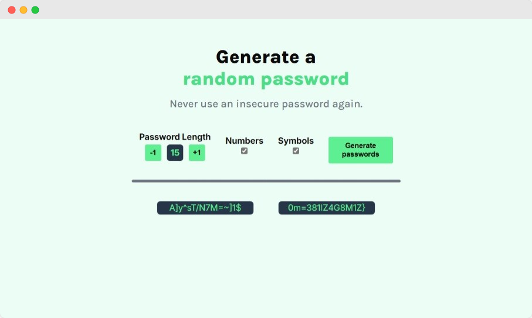
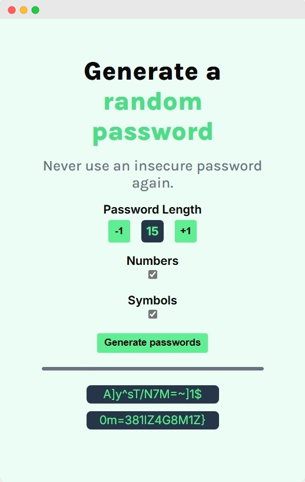

# Password Generator

Veja também em [Português](./README.md)

## Description

A website for generating passwords made with HTML, CSS and JavaScript. Being part of the solo project "Password Generator" at the [Scrimba](https://scrimba.com/) platform. Developed in the Front-End Developer Path.

## Resources

- Responsive Interface
- Functions for Adjusting Password Characteristics
  - Password Size
  - On/Off Toggle for Number Generation
  - On/Off Toggle for Symbols Generation
- Minimum and Max Password Size Limiter

> [!NOTE]
> The minimum password length is 1, while the max length is 15 characters.
>
> It is only possible to adjust if a password can contain **numbers** and **symbols**. Is not possible to adjust if a password can contain or not letters.

## Images

Website view from a large screen:

Website view from a thin screen:

