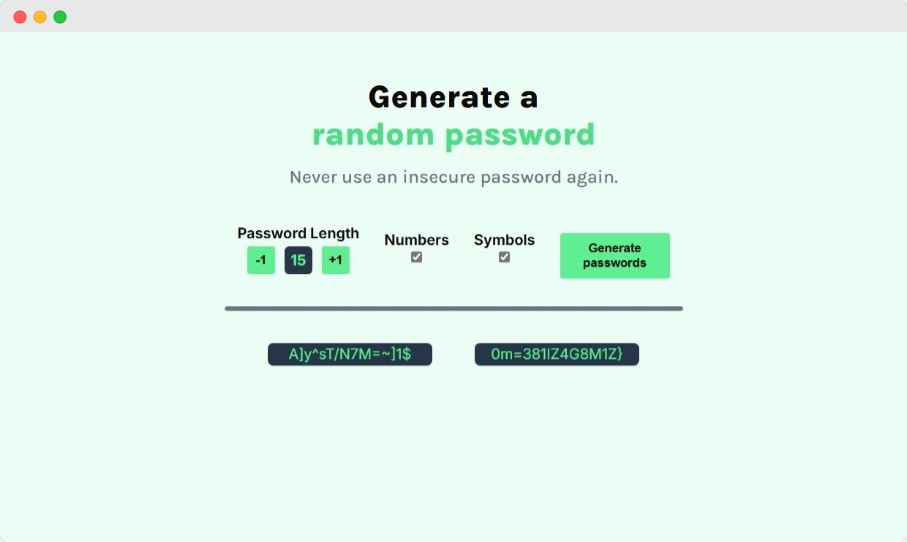
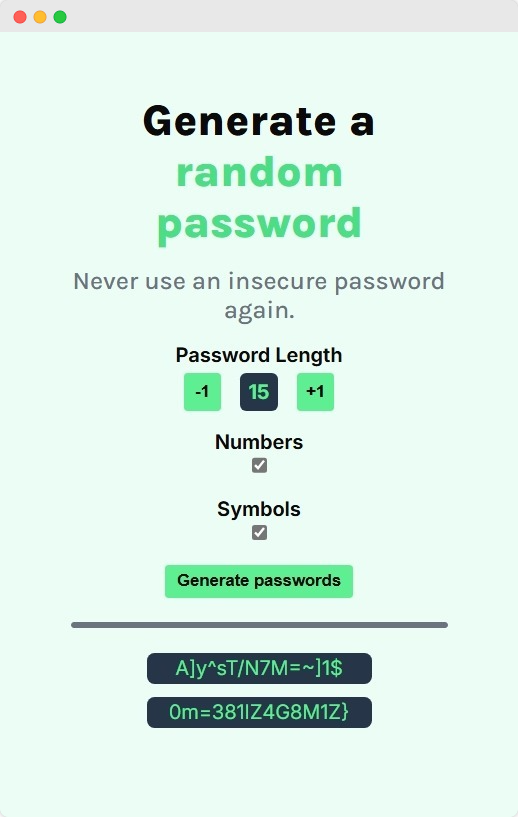

# Gerador de Senhas

See also in [English](./README-EN.md)

## Descrição

Um site para geração de senhas feito utilizando HTML, CSS e JavaScript. Sendo parte do projeto solo "Password Generator" na plataforma [Scrimba](https://scrimba.com/). Desenvolvido no curso de Desenvolvedor Front-End.

## Recursos

- Interface Responsiva
- Funções para Ajustar as Características da Senha
  - Ajuste de Tamanho de Senha
  - Ativar/Desativar Números na Senha
  - Ativar/Desativar Símbolos na Senha
- Limitador de Mínimo e Máximo de Caracteres Gerados

> [!NOTE]
> A quantia mínima de caracteres é 1, a quantia máxima é 15.
>
> É possível apenas ajustar se a senha pode conter ou não **números** e **símbolos**. Não sendo possível ajustar a aparição de letras.

## Imagens

Visualização do Website em uma tela larga:

Visualização do Website em uma tela pequena:

